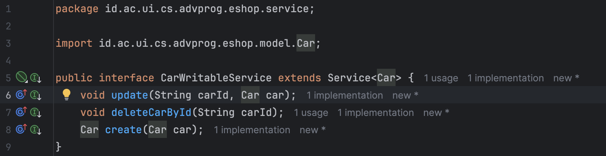
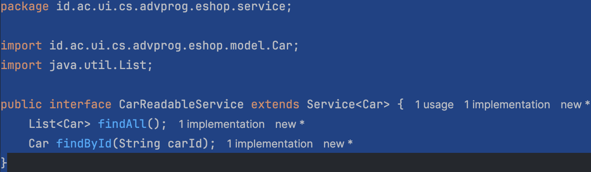
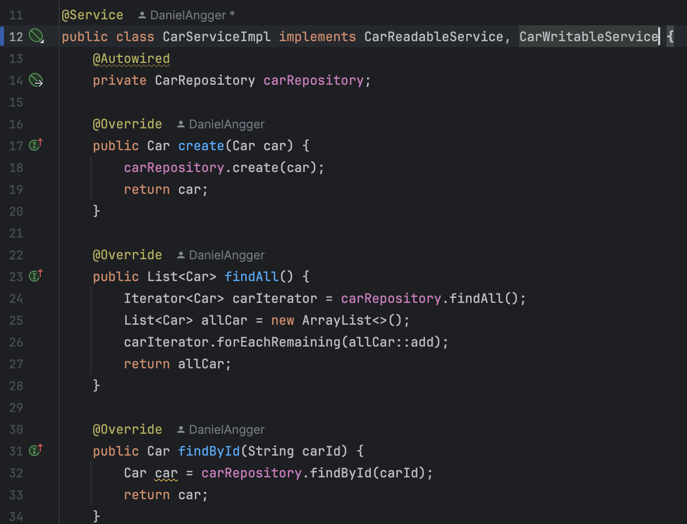
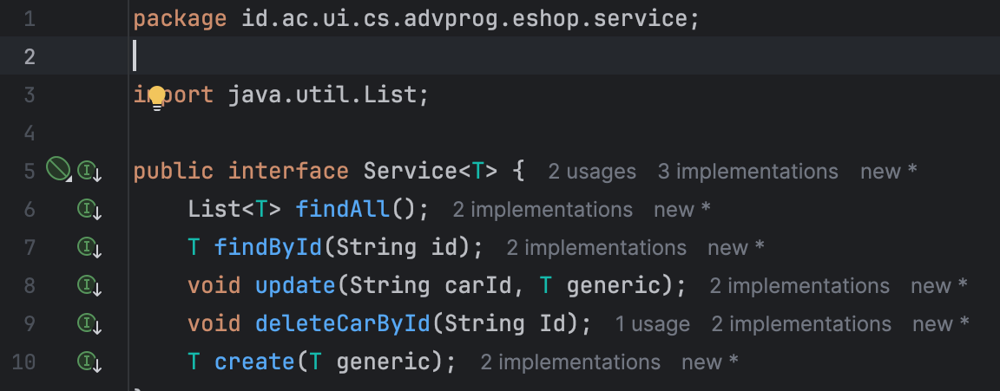
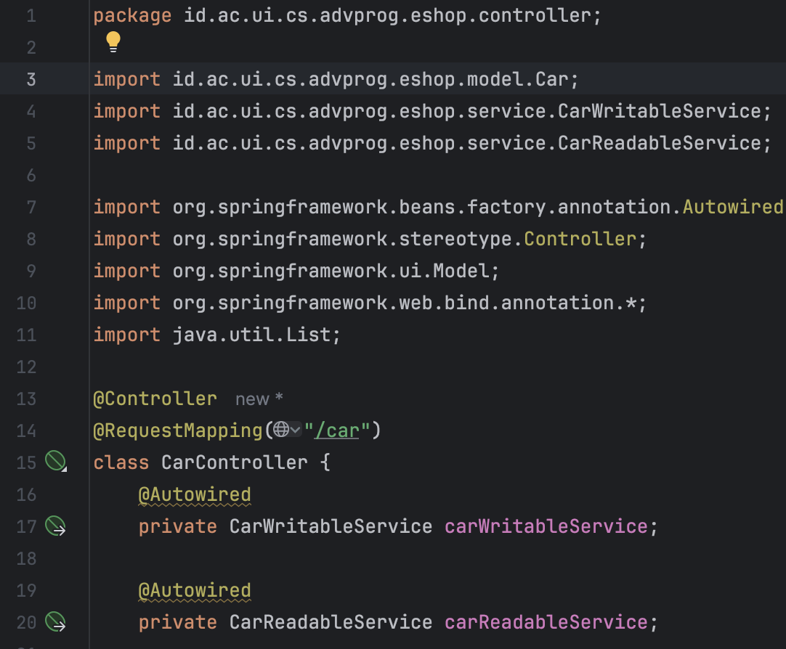

# eshop_advpro

## Link -> https://alright-carlen-danielangger-00867105.koyeb.app

## Tutorial 1
### Reflection 1
Saya sudah memperlajari cara menulis kode dengan prinsip "clean code" dan "secure code practices" minggu ini, dan saya rasa saya sudah berusaha untuk menerapkannya pada tutorial kali ini, saya sudah bertanya kepada teman saya tentang kode saya, dan mereka rata-rata langsung mengetahui dan bisa mempelajari maksud kode saya dan apa yang coba saya lakukan, jadi secara garis besar, saya rasa saya sudah menerapkan apa yang saya pelajari minggu ini, tidak hanya kebenaran sintaks dan fungsionalnya saja.
1. Pertama, saya sudah mengaplikasikan meaningful names dalam kode saya, yaitu kelas atau variable yang menggambarkan fungsinya. Ini membuat kode saya mudah dikelola di kemudian hari oleh orang lain.
2. Melalui clean code juga, saya sudah menggunakan custom function. Funsinya sama, yaitu membuat kode saya mudah dibaca oleh orang lain bila orang lain itu harus mengelola kode kita.
3. Saya juga sudah mengaplikasikan komentar-komentar pendukung. Ini berfungsi untuk memberi tahu gambaran dasar tentang apa yang penggalan kode tersebut lakukan, bagaimana perilakunya, dan pendekatannya.

### Reflection 2
1. Setelah menulis berbagai unit test, saya merasa kagum terhadap seorang tester, karena seorang tester harus bisa berpikir kreatif untuk membuat test yang bisa mencakup semua fungsional dari sebuah program. Untuk seberapa banyak unit test yang harus kita buat, sebuah unit test harus bisa mencakup semua fungsional yang ada pada program, jadi seberapa banyaknya tergantung skala program yang ditest. Dan ini juga berkaitan dengan verifikasi program kita, untuk program kita bisa terverifikasi, kita perlu membuat unit test sebanyak fungsional prorgam yang harus ditest. Dan bila pun kita memiliki 100% kode yang tercover. Karena itu hanya menunjukkan sebuah skala yang bisa dihitung, bukan kebenaran suatu program. Pasti banyak edge-case yang harus dipikirkan juga.
2. Bila kita membuat sebuah kelas baru yang kelas sebelumnya sebagai acuan, kita perlu memikirkan kemungkinan redundansi, atau kode yang tumpang tindih atau berulang. Bila memang kode itu sudah ada sebelumnya dan kita ingin menggunakannya lagi,kita bisa menggunakan konsep inheritance atau implement.

## Tutorial 2
### Reflection
1. Saya sudah menyelesaikan salah satu masalah saat melakukan scanning code, yaitu "Unnecessary modifier 'public'" pada ProductService.java saya, khususnya pada abstract method findAll(). Strategi saya adalah memahami masalah yang disajikan pada report yang ada, kemudian saya diarahkan pada dokumentasi yang ada, kemudian saya mengikuti dokumentasi itu dan menyelesaikan masalahnya. Terbukti, masalah tersebut tidak muncul lagi di commit berikutnya.
2. Ya, saya sudah mengimplementasikan CI/CD pada workflows saya. Pertama, saya sudah membuat file ci.yml yang berfungsi untuk menjalankan test dan menguji kode saya, yang kemudian disajikan dalam html file yang berisi laporan hasil test oleh JaCoCo. Lalu, untuk CD, memang tidak eksplisit terdapat di workflows saya, tetapi saya menggunakan PaaS Koyeb, dimana Koyeb memiliki fitur auto-deploy yang bisa diintegrasikan langsung ke repositori GitHub, jadi setiap saya melakukan push ke master, itu sudah mengimplementasikan CD.

## Tutorial 3
### Reflection
1. Saya sudah berusaha mengaplikasikan prinsip SOLID (SRP, OCP, LSP, ISP, DIP) dalam tutorial kali ini, dibuktikan dengan:
   > Prinsip SRP:
    
    
    Pada saat menerapkan prinsip SRP, saya memecah file interface CarService menjadi 2, yaitu CarReadableService dan CarWritableService. Hal ini saya lakukan untuk menajamkan fungsi dari masing-masing interface. CarReadableService berfungsi sebagai interface yang bertanggung jawab pada fungsi-fungsi yang hanya membaca (R). Sedangkan CarWritableService berfungsi sebagai interface yang bertanggung jawab pada fungsi-fungsi CRD (Create, Update, Delete) atau yang melakukan overwrite.

   > Prinsip OCP:
    
    
    
    Saya juga menerapkan prinsip OCP, tepatnya pada bagian service. Karena sebelumnya saya sudah memecah interface CarService menjadi CarReadableService dan CarWriteableService, sekarang bila saya ingin menambahkan implementasi baru, saya tidak perlu mengubah CarServiceImpl lagi. Misalnya saya ingin menggunakan MySQL untuk List<Car>, saya tidak perlu mengubah CarServiceImpl, saya hanya perlu membuat CarDatabaseServiceImpl yang mengimplementasi interface saya sebelumnya.
    
    > Prinsip LSP:
    
    
    
    Sekarang saya mengaplikasikan prinsip LSP. Saya membuat kerangka dasar dari interface yang saya gunakan, yaitu Service. Lalu, saya membuat interface CarReadableService dan CarWriteableService mengimplementasikan interface kerangka tersebut. Dengan begini, dimanapun CarWriteableService atau CarReadableService digunakan, Service juga bisa digunakan tanpa mengubah perilaku dari kode.
    
    > Prinsip ISP:
    
    
    Sekarang adalah prinsip ISP. Karena sebelumnya saya sudah membagi tugas interface saya menjadi CarReadableService dan CarWriteableService, maka sekarang kode saya tidak terpaksa menggunakan interface yang tidak diperlukan. Sekarang, yang diimplementasikan hanya interface yang diperlukan saja.
    
    > Prinsip DIP:
    
    Sekarang saya juga sudah mengaplikasikan prinsip DIP. Sekarang CarController bergantung pada interface CarService, bukan implementasi yang konkret (CarServiceImpl). Jadi, sekarang Jika ingin mengganti implementasi CarService, kita cukup mengganti @Service tanpa mengubah controller. Ini sudah mengikuti prinsip DIP, membuat kode lebih fleksibel dan mudah diuji.

2. Setelah mengaplikasikan prinsip SOLID, saya telah mendapat banyak keuntungan. Saat mengaplikasikan prinsip SRP, sekarang kelas-kelas pada kode saya lebih rapi dan modular dan di kemudian hari lebih mudah dikelola, karena sekarang satu kelas hanya bertanggung jawab pada satu hal. Setelah mengaplikasikan prinsip OCP, kode saya sekarang bisa ditambahkan fitur baru tanpa merusak perilaku kode lama, karena sekarang kode saya terbuka untuk diperluas, tetapi tertutup untuk dimodifikasi. Setelah mengaplikasikan LSP, sekarang polimorfisme bisa bekerja dengan baik, tanpa ada pengecekan instance terlebih dahulu, dan kode saya juga lebih fleksibel dan reusable. Setelah mengaplikasikan ISP, sekarang kode saya mengimplementasikan metode dari sebuah interface yang sebenarnya tidak diperlukan, jadi sekarang kode saya lebih mudah dipahami. Setelah mengaplikasikan DIP, sekarang kode saya mudah saat melakukan testing, dan bisa mengganti implementasi interface tanpa merusak bagian kode lain.  
3. Sebelum mengaplikasikan prinsip SOLID, saya mendapat banyak kerugian. Sebelum mengaplikasikan SRP, kelas-kelas pada kode saya terlalu besar, sehingga sulit dipahami dan dimodifikasi. Sebelum mengaplikasikan OCP, setiap fitur baru butuh mengedit kode lama, sehingga bisa menyebabkan bug pada kode lama, ini membuat kode sulit dikembangkan. Sebelum mengaplikasikan LSP, saya harus mengecek tipe objek terlebih dahulu dan polimorfisme tidak bekerja dengan baik, ini membuat sulit menambahkan tipe baru tanpa banyak merubah kode lama. Sebelum menggunakan ISP, interface saya terlalu besar, sehingga banyak kelas yang mengimplementasikan fungsi yang sebenarnya tidak perlu, ini membuat kode sulit dipahami dan tidak reusable. Sebelum menggunakan DIP, kode saya langsung bergantung pada kelas konkret, yang membuat sulit mengganti implementasi, dan ini membuat kode saya sulit ditesting juga.